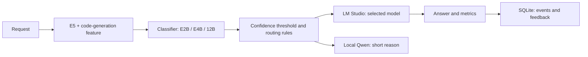

# Local LLM Router — console edition

[Русский](README.md)

A local command-line router for three models served by LM Studio. This is a standalone console package with no desktop UI. The classifier estimates the request category, difficulty and model probabilities; a small local Qwen writes a one-sentence explanation. Requests and feedback are stored in a local SQLite database.

**Example from a clean-install check:** “Give a simple borscht recipe for two” (original request in Russian) → category `general`, difficulty `2/9`, confidence `68.9%`, selected tier `E2B`. The short reason says it is a simple general question. [See the measured 100-request benchmark and its limitations](docs/BENCHMARK.md).



At 60% confidence or higher, the predicted tier is selected. Below the threshold, the request moves up one tier when possible. An additional rule escalates hard borderline requests. Feedback can propose a label, but only human review and a separate retraining step can change the active classifier.

## Setup

You need macOS on Apple Silicon, Python 3.11+, and an LM Studio API server. Python 3.13 is the tested version. The explanation model runs directly in Python through MLX. Install your E2B, E4B and 12B answer models in LM Studio separately.

```sh
python3 -m venv .venv
.venv/bin/python -m pip install -r requirements.txt
.venv/bin/python tools/download_models.py --lang en
cp config/settings.example.json config/settings.json
```

Edit `config/settings.json` with the LM Studio server address and the **full model IDs** for the three slots. E2B, E4B and 12B describe approximate capability tiers; the program does not verify model size. The default server is `http://127.0.0.1:1234`. For LAN use, LM Studio must listen on the relevant interface.

E5 and Qwen weights are excluded from the repository and downloaded from Hugging Face into `models/` by the setup command. Model revisions and tested top-level dependency versions are pinned. The included `classifier/router.pkl` is trained on Russian and English examples. Only load a pickle file from a trusted source.

## Run

```sh
.venv/bin/python router.py --lang en
.venv/bin/python router.py --lang ru
```

Each prompt is an independent request. An empty line exits. For a short translation predicted as E2B, the router may reuse an already loaded E4B; disable this with `--no-reuse-loaded-e4b`. Use `--collect-feedback-labels` to queue suggested labels for review.

## Data and benchmark

```sh
.venv/bin/python benchmark.py --lang en --check
.venv/bin/python benchmark.py --lang en --limit 10
.venv/bin/python real_data.py --lang en status
.venv/bin/python real_data.py --lang en list
.venv/bin/python retrain.py --lang en status
```

The benchmark reads `data/benchmark/requests.jsonl` and writes results into `benchmark_runs/`. It does not run during setup. Events and feedback live in `feedback/feedback.sqlite3`. These outputs are excluded from Git because they may contain personal prompts and responses.

Use `--requests data/benchmark/requests_100.jsonl` for the published 100-request input set. [A summary of one measured run is available](docs/BENCHMARK.md); full answers and process telemetry remain local. The benchmark does not grade answer quality.

`data/training/requests_ru.jsonl` and `requests_en.jsonl` contain 500 synthetic examples per tier in each language. The generators are `tools/build_dataset.py` and `tools/build_english_dataset.py`. Training and retraining:

```sh
.venv/bin/python train.py --lang en
.venv/bin/python real_data.py --lang en export
.venv/bin/python retrain.py --lang en train
# after reviewing the candidate results:
.venv/bin/python retrain.py --lang en promote RUN_ID
```

Feedback suggestions do not alter the active classifier automatically. Review and approve them with `real_data.py`; candidate training needs at least 20 unique approved requests per tier. Promotion backs up the active classifier.

## File map

`router.py` starts the prompt loop; `benchmark.py` records measurements; `train.py`, `real_data.py` and `retrain.py` handle training and reviewed feedback. `llm_router/` contains the implementation; `llm_router/storage/schema.sql` is the SQLite schema; `data/` holds synthetic inputs; `tools/download_models.py` installs E5 and Qwen. Create local settings from `config/settings.example.json`.

Checks that need neither LM Studio nor model weights: `.venv/bin/python -m unittest discover -s tests -v` and `.venv/bin/python benchmark.py --check`. GitHub Actions runs the same checks on code changes.

## License

The source is available under [PolyForm Noncommercial 1.0.0](LICENSE), which permits personal and other noncommercial use. Commercial use requires a separate agreement with the copyright holder; contact me on Telegram: [@kylebrka](https://t.me/kylebrka). Downloaded models have their own Hugging Face and LM Studio terms.
