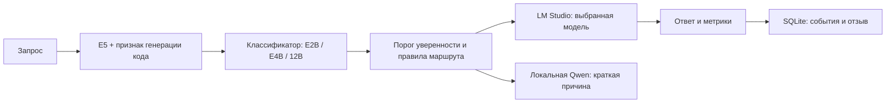

# Local LLM Router — консольная версия

[English](README.en.md)

Локальный маршрутизатор запросов между тремя моделями в LM Studio. Это самостоятельная консольная сборка без графического интерфейса. Классификатор определяет тему, сложность и вероятность подходящего уровня; небольшая локальная Qwen формулирует одну причину выбора. Запросы и отзывы сохраняются в локальной SQLite базе.

**Пример из проверки чистой установки:** запрос «Дай простой рецепт борща на две порции» → тема `general`, сложность `2/9`, уверенность `68,9%`, выбрана `E2B`. Причина: «Выбрана модель E2B, потому что это простой общий вопрос». [Условия и итоги бенчмарка на 100 запросах](docs/BENCHMARK.md).



При уверенности от 60% используется предсказанный уровень; ниже порога запрос поднимается на один уровень, если это возможно. Для сложных пограничных запросов есть дополнительное повышение. Отзыв может предложить метку, но активный классификатор меняется только после ручной проверки и отдельного переобучения.

## Установка

Нужны macOS на Apple Silicon, Python 3.11+ и LM Studio с сервером API. Проверенная версия Python — 3.13. Модель причин работает в Python через MLX. Модели ответов E2B, E4B и 12B устанавливаются в LM Studio отдельно.

```sh
python3 -m venv .venv
.venv/bin/python -m pip install -r requirements.txt
.venv/bin/python tools/download_models.py --lang ru
cp config/settings.example.json config/settings.json
```

Укажите в `config/settings.json` адрес сервера LM Studio и **полные идентификаторы** трёх моделей. E2B, E4B и 12B означают приблизительные уровни возможностей; программа не проверяет их размер. По умолчанию сервер `http://127.0.0.1:1234`. При работе по сети LM Studio должен слушать нужный интерфейс.

Веса E5 и Qwen не входят в репозиторий: они скачиваются командой выше с Hugging Face в `models/`. Скрипт закрепляет ревизии моделей, а `requirements.txt` — проверенные версии основных библиотек. Классификатор `classifier/router.pkl` уже включён и обучен на русских и английских примерах. Загружайте pickle только из доверенного источника.

## Работа

```sh
.venv/bin/python router.py --lang ru
.venv/bin/python router.py --lang en
```

Каждая строка запроса обрабатывается отдельно. Пустая строка завершает программу. Для короткого перевода, предсказанного как E2B, роутер может использовать уже загруженную E4B; отключение: `--no-reuse-loaded-e4b`. Для сбора предложенных меток отзывов: `--collect-feedback-labels`.

## Данные и проверка

```sh
.venv/bin/python benchmark.py --lang ru --check
.venv/bin/python benchmark.py --lang ru --limit 10
.venv/bin/python real_data.py --lang ru status
.venv/bin/python real_data.py --lang ru list
.venv/bin/python retrain.py --lang ru status
```

Бенчмарк читает `data/benchmark/requests.jsonl`, а результаты создаёт в `benchmark_runs/`. Он не запускается при установке. События и отзывы находятся в `feedback/feedback.sqlite3`. Эти файлы исключены из Git, поскольку могут содержать личные запросы и ответы.

Для полного воспроизводимого набора входных данных используйте `--requests data/benchmark/requests_100.jsonl`. [Опубликована сводка одного измеренного прогона](docs/BENCHMARK.md); исходные полные ответы и телеметрия в репозиторий не добавлены. Бенчмарк не оценивает качество ответов.

Датасеты `data/training/requests_ru.jsonl` и `requests_en.jsonl` содержат по 500 синтетических примеров на каждый уровень в каждом языке. Их генераторы — `tools/build_dataset.py` и `tools/build_english_dataset.py`. Обучение и переобучение:

```sh
.venv/bin/python train.py --lang ru
.venv/bin/python real_data.py --lang ru export
.venv/bin/python retrain.py --lang ru train
# после просмотра результатов кандидата:
.venv/bin/python retrain.py --lang ru promote RUN_ID
```

Предложенная отзывом метка не меняет модель автоматически. Для переобучения её нужно проверить и одобрить через `real_data.py`. Для кандидата нужны хотя бы 20 уникальных одобренных запросов на каждый уровень. Продвижение кандидата сохраняет резервную копию активного классификатора.

## Где что лежит

`router.py` — запуск диалога; `benchmark.py` — измерения; `train.py`, `real_data.py`, `retrain.py` — обучение и проверка отзывов. `llm_router/` содержит логику, `llm_router/storage/schema.sql` — схему SQLite, `data/` — синтетические входные данные, `tools/download_models.py` — загрузку E5 и Qwen. Настройки создаются из `config/settings.example.json`.

Проверки без LM Studio и весов моделей: `.venv/bin/python -m unittest discover -s tests -v` и `.venv/bin/python benchmark.py --check`. Те же проверки запускаются в GitHub Actions при изменениях кода.

## Лицензия

Исходный код доступен по [PolyForm Noncommercial 1.0.0](LICENSE): личное и другое некоммерческое использование разрешено. Для коммерческого использования требуется отдельное разрешение правообладателя; свяжитесь со мной в Telegram: [@kylebrka](https://t.me/kylebrka). Лицензии загружаемых моделей регулируются их карточками на Hugging Face и условиями LM Studio.
